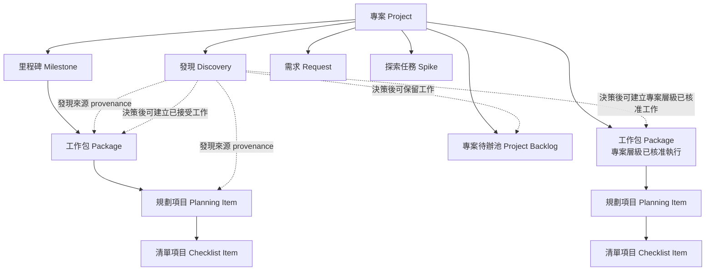
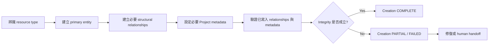

# PM 核心資源模型

> 狀態：M1 / PM-P01 / PLAN02 — 中文化修訂完成，待重新審查
>
> 用途：定義 canonical 專案管理資源、資源之間的結構歸屬關係，以及所有 PM skills 與 storage adapters 都必須維持的 integrity 規則。

本文件是**資源結構與關係完整性**的 authoritative source of truth。Workflow `Status` transition、review authority、approval policy 與 Discovery decision routing 不在本文件定義範圍內，分別由其他專屬 contract 負責。

## 1. 設計原則

1. 資源結構不依賴任何特定 storage product。
2. 結構歸屬、workflow Status、Scope commitment、provenance（來源脈絡）與 Dependency（相依關係）是不同維度。
3. **執行歸屬（Execution Placement）是已接受 Package 的 canonical structural placement relation；它不是第二份 ownership record。**
4. 每一種 structural relationship 都只能有一個 authoritative source of truth。
5. Child resource 不應重複維護可以從 parent 推導出的 ownership metadata；除非 adapter 明確把它維護為 denormalized projection（非正規化投影）。
6. 建立 entity 本身不代表建立完成；必要 relationship 與 Project metadata 也必須建立並驗證。
7. 缺少必要 relationship 的 resource 屬於 incomplete / invalid creation state，不得回報為建立成功。
8. 專案待辦池（Project Backlog）membership 是明確的 Project-level placement relation；不能由 workflow Status 或缺少 Milestone metadata 推導。
9. 每個已接受 Package 必須且只能有一個明確的 **Execution Placement**：某一個 Milestone，或所有 Milestone 之外的「專案層級已核准執行」。

---

## 2. Canonical 資源階層



實線代表 canonical structural relationship。

對已接受的 Package 而言，指向 Package 的 incoming structural edge 就是它的 **Execution Placement**。上圖的兩個 Package node 是**同一種 canonical Package resource type**，只是分別顯示在兩種合法執行歸屬下：

1. Milestone 執行 — `Milestone → Package`；或
2. 專案層級已核准執行 — `Project → Package`，且不屬於任何 Milestone。

這不是同時維護 ownership 與 placement 兩份紀錄；Execution Placement edge 本身就是 Package 的 authoritative structural placement。

較低層工作則由 `Package → Planning Item → Checklist Item` 表示 Parent / Child decomposition。

虛線代表 context 或 decision-driven relationship，不代表 ownership。

### 2.1 專案（Project）

Project 是持久存在的最高層管理邊界。

Project 擁有或提供以下資源的 context：

- Milestone；
- 專案層級已核准執行的 Package；
- Project Backlog membership；
- Package；
- 透過 Package 所屬的 Planning Item；
- Discovery；
- Request；
- Spike；
- 後續經核准 contract 所引入的其他 Project records。

Project 不是 workflow `Status`，本身也不代表 delivery deadline。

### 2.2 里程碑（Milestone）

Milestone 是由 Goal、Scope 與 Exit Criteria 治理的有限交付目標。

Canonical structural rule：

> Milestone 是已接受 Package 的合法 Execution Placement，不是 Planning Item 的直接 Execution Placement。

當 Package 的 Execution Placement 指向某一個 Milestone，該 Package 就直接 committed 到這個 Milestone。

Planning Item 透過 Parent Package 繼承 Milestone membership。

因此 Milestone 不應再維護第二份相同 Planning Item 的 direct scope child 清單。

### 2.3 工作包（Package）

Package 是已接受、具有穩定識別且可獨立追蹤的工作單位。

Package 必須且只能有一個 canonical **Execution Placement**；這個 relation 同時就是 Package 的 authoritative structural placement：

- **Milestone 歸屬** — `Milestone → Package`；Package 直接 committed 到且只能屬於一個 Milestone；或
- **專案層級已核准執行** — `Project → Package`；Package 已被核准直接在 Project 下執行，且刻意不屬於任何 Milestone。

Package 可以：

- 透過 Execution Placement 屬於某個 Milestone；
- 透過 Execution Placement 在所有 Milestone 之外進行 Project-level approved execution；
- 擁有 0 個或多個 Planning Item；
- 與同層工作形成 Dependency；
- 擁有自己的 workflow `Status`、Priority、Sequence、Acceptance Criteria 與 implementation context。

Package 不得同時使用兩種 canonical Execution Placement。Adapter 也不得在 Execution Placement 之外再建立第二個 authoritative Package ownership field。

Package 從一種 placement 移動到另一種 placement，屬於受治理的 project-management mutation，不是普通的 workflow Status change。

Package identity 必須保持穩定，不能把執行順序編進 identity。

### 2.4 規劃項目（Planning Item）

Planning Item 是 Package 底下可獨立追蹤的工作拆解。

Canonical invariant：

> **每個 Planning Item 必須且只能有一個 Parent Package。**

Planning Item：

- 必須且只能有一個 Parent Package；
- 繼承 Parent Package 的 Execution Placement，以及存在時的 Milestone scope membership；
- 可以有自己的 `Status`、Acceptance Criteria、blocker state、discussion 與 deliverable；
- 不得維護互相衝突的獨立 Milestone 或 execution-placement ownership record。

沒有 Parent Package 的 Planning Item 是 **orphan（孤兒）**，不得視為建立成功。

### 2.5 清單項目（Checklist Item）

Checklist Item 是嵌入在 Package 或 Planning Item 裡的輕量執行細節。

除非它需要自己的 lifecycle、discussion、blocker state、acceptance record 或 ownership relationship，否則不應提升成獨立 resource。

---

## 3. 專案待辦池（Project Backlog）模型

### 3.1 定義

Project Backlog 是 Project-level retained-work collection，用來保存**目前尚未 committed 到 active Milestone 或其他明確已核准 execution scope**、但仍可能有價值的工作。

Project Backlog 是 Scope / commitment placement concept。

它不是 workflow `Status`。

Canonical rule：

> **Project Backlog ≠ `Status = Backlog`**

### 3.2 Authoritative membership

Project Backlog membership 必須由明確、authoritative 且 PM skill / adapter 可以 deterministic query 的 placement relationship 表示。

Canonical domain model 至少要求等價於以下關係：

```text
Project Backlog membership = TRUE | FALSE
```

Storage adapter 可以使用 field、collection、label、relationship 或其他支援方式落地，但只能有一個不含糊的 source of truth。

### 3.3 禁止的推導方式

PM skill 或 adapter 不得只依據以下任一條件推導 Project Backlog membership：

```text
Status = Backlog
```

或：

```text
Milestone = empty
```

原因：

- 已 committed 到 Milestone 的 Package，在等待執行時可以合法處於 `Status = Backlog`。
- 專案層級已核准執行的 Package 刻意沒有 Milestone，但仍是 accepted work。
- Planning Item 可以刻意不直接維護 Milestone metadata，因為其 Execution Placement 與 Milestone ownership 是由 Parent Package 繼承。
- 其他 Project-level resource 也可能合法沒有 Milestone，但並不屬於 Project Backlog。

### 3.4 常見 Project Backlog 成員

依 triage 結果，Project Backlog 可以保存：

- Request；
- 延後處理的 Bug；
- 延後處理的架構工作；
- Discovery 所產生但尚未 committed 的工作；
- 未來可能進行的 Spike；
- 其他尚未承諾但具有價值的工作。

是否把某項工作放入 Project Backlog，由 decision model 決定，不由本 structural contract 決定。

### 3.5 Project Backlog 與已接受執行工作

保留在 Project Backlog 的 resource 位於 approved execution scope 之外。

一旦工作被接受成為要執行的 Package，就必須離開 Project Backlog placement，並取得且只能取得一個 canonical Execution Placement：

```text
Milestone:<id>
```

或：

```text
專案層級已核准執行
```

同一個 item 不得同時是 authoritative Project Backlog work 與 accepted execution Package。

---

## 4. 輸入與執行中出現的工作資源

### 4.1 發現（Discovery）

Discovery 是在 project-management decision 做出之前，用來保存證據與 context 的 Project-level record。

Discovery 可以用 `Discovered In` 連結到 Milestone、Package、Planning Item、review、execution activity 或 incident。

`Discovered In` 只代表 provenance（來源脈絡）。

它不會讓 Discovery 自動成為「被發現位置」底下的 structural child。

Canonical rule：

> **在 Milestone 中發現 ≠ 屬於該 Milestone（FOUND DURING MILESTONE ≠ BELONGS TO MILESTONE）**

Discovery 經 triage 後可以連到 resulting work 或 Project Backlog placement，但 Discovery 本身不能默默修改 Scope。

### 4.2 需求（Request）

Request 是尚未被接受進入 execution scope 的 proposed work。

Request 可以在 Project-level 等待 triage，也可以被保留在 Project Backlog、Reject，或產生 accepted work。

Resource model 定義它可以存在的位置；decision model 定義如何做出上述決策。

### 4.3 探索任務（Spike）

Spike 是有明確邊界的 investigation resource。

依調查原因不同，Spike 可以位於 Project-level，或與已核准 Package 關聯。它的 structural placement 必須明確，不能由「不確定性最早在哪裡被發現」來推導。

Spike 的 decision semantics 與 completion routing 由 decision model 負責。

---

## 5. 關係分類

Canonical model 區分以下 relationship type，同時要求每一個 persisted relation 都只有一個 source of truth。

### 5.1 結構關係（Structural Relationships）

Structural relationship 回答：

> 這個 resource 在 canonical PM model 中正式屬於哪裡？

主要包含兩種 subtype：

```text
Structural relationship
├─ Package Execution Placement
│  ├─ Milestone → Package
│  └─ Project → Package [專案層級已核准執行]
└─ Parent / Child decomposition
   ├─ Package → Planning Item
   └─ Planning Item → Checklist Item
```

`Project → Milestone` 也是 delivery-boundary level 的 structural containment relationship。

同一個 persisted relationship 可以有更專門的 semantic name。`Milestone → Package` 與 `Project → Package [專案層級已核准執行]` 特別稱為 **Execution Placement**，因為它們表示 Package 正式屬於哪個 approved execution scope。

這個 specialized name **不代表需要第二份 ownership record**。

### 5.2 執行歸屬（Execution Placement）

Execution Placement 是 **Package 專用的 structural placement relation**。

它回答：

> 這個已接受的 Package 現在正式屬於哪一個已核准執行範圍？

每個已接受 Package 必須且只能有一個 canonical Execution Placement：

```text
Milestone:<id>
```

或：

```text
專案層級已核准執行
```

對 Package 而言：

> **Execution Placement = authoritative structural placement**

不得再存在另一個互相競爭的 `Package Owner`、`Structural Owner` 或等價 canonical relationship，去重複表示相同的 Milestone / Project placement。

同一時間一個 Package 只能位於其中一種 placement。

「專案層級已核准執行」用於必須在所有 Milestone 之外立即／主動執行的 accepted work，例如已核准 Interruption。它**不會**默默擴大 active Milestone Scope。

Package 要進入「專案層級已核准執行」，必須具備來自適用 decision / approval contract 的明確 approved decision / authorization context。只有 `Milestone = empty` 不足以證明這個 placement。

Storage adapter 必須從單一 authoritative representation 暴露或推導足夠資訊，使 PM skill 能區分：

- Milestone Package；
- 專案層級已核准執行的 Package；
- Project Backlog work；
- 其他 Project-level record。

若 storage product 同時提供 native relationship 與 projection field，必須指定其中一份為 authoritative，另一份只能是 derived metadata；兩者不能都是獨立可寫入的 source of truth。

### 5.3 Project Backlog placement

Project Backlog placement 回答：

> 這個 retained work 是否目前位於 approved execution scope 之外，並正式被放在 Project Backlog？

這是 Project-level commitment / placement relationship，不是 workflow state。

Project Backlog placement 與 accepted Package Execution Placement 必須互斥。

### 5.4 來源脈絡（Provenance / `Discovered In`）

Provenance 回答：

> 這項資訊是在什麼地方被發現？

Provenance relationship 不代表 ownership、scope membership、Priority 或 execution order。

### 5.5 相依關係（Dependency）

Dependency 回答：

> 哪一項工作限制另一項工作能否或何時繼續？

常見語意包括：

- blocks；
- blocked by；
- requires；
- prerequisite for。

Dependency 與 structural placement / Parent / Child relationship 是互相獨立的概念。

### 5.6 Workflow 關係

Workflow state 與 state transition 描述 execution lifecycle，不描述 structural placement。

Authoritative workflow state machine 將由 PLAN07 完成後的 `docs/core/workflow-contract.md` 定義。

---

## 6. 歸屬與 Scope 繼承

### 6.1 Milestone Execution Placement 鏈

一般 Milestone work 的 canonical structural chain：

```text
Project
└─ Milestone
   └─ Package
      └─ Planning Item
```

對 Package 而言，`Milestone → Package` 就是它唯一 authoritative 的 Execution Placement。

Planning Item 繼承該 Package 的 Milestone scope membership。

### 6.2 Child 不重複維護 Milestone ownership

當 Parent Package 已能決定 Milestone relationship 時，Planning Item 不應維護另一份獨立 canonical Milestone ownership record。

若 storage tool 為方便查詢而提供重複的 Milestone field，該欄位只能是 denormalized projection，不得覆蓋 Parent Package relationship 與繼承而來的 Execution Placement。

若 projected Milestone 與 Parent Package 的 Execution Placement 衝突，以 Parent Package 所推導出的 placement 為 authoritative，adapter 必須回報或修復 inconsistency。

### 6.3 專案層級已核准執行的 Execution Placement 鏈

Approved work 可以在所有 Milestone 之外執行，而不修改任何 Milestone Scope。

Canonical structural chain：

```text
Project
└─ Package [Execution Placement = 專案層級已核准執行]
   └─ Planning Item
```

對 Package 而言，`Project → Package [專案層級已核准執行]` 就是它唯一 authoritative 的 Execution Placement。

這條路徑用於 project-management decision 已授權立即／主動執行工作，但明確要求它保持在 Milestone Scope 之外的情境。

例如：已核准的 Interruption 可以在 current Milestone 不變的情況下，建立或啟用一個 Project-level approved execution Package。

Canonical rules：

```text
已核准執行工作 ≠ current Milestone member
```

以及：

```text
Milestone = empty ≠ 專案層級已核准執行
```

第二條特別重要，因為只看 Milestone metadata 為空，無法區分 Project-level approved execution、Project Backlog work 或其他 Project-level record。

### 6.4 Execution Placement 繼承

Planning Item 繼承 Parent Package 的 Execution Placement；它本身不擁有第二份 Execution Placement relation。

因此：

- Milestone Package 底下的 Planning Item，間接屬於該 Milestone Scope；
- 專案層級已核准執行 Package 底下的 Planning Item，仍位於所有 Milestone 之外；
- Planning Item 不得維護競爭性的第二份 canonical execution-placement record。

### 6.5 Placement 之間的移動

Package 從一種 Execution Placement 移動到另一種，會改變 Project commitment / Scope placement，必須透過適用的 decision / approval process。

例如：

```text
Project Backlog → Milestone
Project Backlog → 專案層級已核准執行
專案層級已核准執行 → Milestone
Milestone → Project Backlog
```

這些都不是普通 workflow Status transition。

---

## 7. Planning Item Parent invariant

### 7.1 合法狀態

合法 Planning Item 必須同時滿足：

```text
Work Type = Planning
Parent Package exists
Parent Package relationship count = 1
Parent Package is a Package resource
Required project metadata is present
Relationship verification succeeds
```

其中 `Work Type = Planning` 為實際 GitHub Project field/value，因此保留英文 token。

### 7.2 非法／未完成狀態

以下都屬於 invalid / incomplete state：

```text
Planning Item 沒有 Parent Package
Planning Item 有多個互相競爭的 Parent Package
Planning Item 的 parent 不是 Package
Planning Item body 雖寫了 parent，但實際 structural relationship 不存在
Planning Item 必要 Project metadata 無法建立
```

Issue body 中的：

```text
Parent Package: #1
```

只是 documentation，不能取代 canonical structural Parent relationship。

### 7.3 Orphan 處理

Agent 發現 orphan Planning Item 時必須：

1. 停止宣稱建立成功；
2. 若證據足夠，找出 intended Parent Package；
3. 在具有 authority 且技術可行時，建立並驗證 Parent relationship；
4. 否則回報 partial failure，要求適當 human 或 capable adapter 完成；
5. 在 structural integrity 修復以前，不開始正常 execution。

---

## 8. 資源建立交易（Resource Creation Transaction）

即使 storage system 需要多次 API call，resource creation 在 PM domain 上仍視為一個 logical transaction。

### 8.1 Canonical 建立階段



### 8.2 建立結果

Creation result 不是 workflow `Status`，而是 operation result。

Canonical operation result token：

- `COMPLETE` — entity 與所有必要 relationship / metadata 均已建立並驗證。
- `PARTIAL` — primary entity 已存在，但一個以上必要 relationship 或 metadata write 尚未完成。
- `FAILED` — primary resource 無法建立，或目前 operation 無法被安全地表示。

### 8.3 強制驗證

當 adapter 支援 read-back verification 時，Agent 在 multi-step creation 完成後必須驗證 persisted state。

對 Planning Item，至少驗證：

```text
Issue exists
Work Type = Planning
Parent Package relationship exists
Parent Package is the intended Package
Required Project membership / metadata exists
```

對已接受 Package，至少驗證：

```text
Package exists
Work Type = Package
Exactly one canonical Execution Placement exists
Execution Placement is the Package's authoritative structural placement
Execution Placement matches the approved decision
No competing Package ownership / placement relationship exists
Project Backlog placement is not simultaneously authoritative
Required Project membership / metadata exists
```

即使 Issue 已成功建立，Agent 也不得把 partial result 包裝成 success。

### 8.4 Adapter capability failure

若 adapter 無法建立某個必要 relationship，正確 operation result 是：

```text
Creation Result = PARTIAL
```

Handoff 必須明確說明：

- 已建立哪些內容；
- 還缺少哪些內容；
- adapter 為什麼無法完成；
- 需要哪個 authorized human 或 capable adapter action。

---

## 9. Canonical 資源完整性不變條件

所有 PM skills 與 adapters 都必須維持：

1. **每個 Planning Item 必須且只能有一個 Parent Package。**
2. 沒有 structural Parent relationship 的 Planning Item 是 orphan 且建立未完成。
3. Issue body 的 parent 文字不能取代 structural Parent relationship。
4. Planning Item 從 Parent Package 繼承 Execution Placement，以及存在時的 Milestone Scope。
5. Child resource 不得建立競爭性的 canonical Milestone 或 Execution Placement source of truth。
6. **每個已接受 Package 必須且只能有一個 Execution Placement。**
7. **Execution Placement 是已接受 Package 的 authoritative structural placement；它不是第二份 ownership record。**
8. 合法 Package Execution Placement 只有「某一個 Milestone」或「所有 Milestone 之外的專案層級已核准執行」。
9. Package 不得同時具有 Milestone placement 與 Project-level approved execution placement。
10. Adapter 不得維護另一個獨立 authoritative Package ownership field 去重複 Execution Placement。
11. **Project Backlog ≠ `Status = Backlog`。**
12. Project Backlog membership 必須有一個明確、authoritative 的表示方式。
13. Project Backlog membership 與 accepted Package Execution Placement 必須互斥。
14. 不得只由 `Status = Backlog` 推導 Project Backlog membership。
15. 不得只由 `Milestone = empty` 推導 Project Backlog membership。
16. 不得只由 `Milestone = empty` 推導 Project-level approved execution。
17. `Discovered In` 是 provenance，不是 ownership。
18. Parent / Child 與 Dependency relationship 不得互相替代。
19. Resource creation 在必要 relationship 與 metadata persisted 並 verified 前都不算完成。
20. Adapter 若無法完成必要 integrity，必須回報 `PARTIAL` 或 `FAILED`，不能回報 success。
21. Storage tool 的技術便利性不能凌駕 canonical structural relationship model。
22. Project Backlog、Milestone execution、Project-level approved execution 之間的移動屬於 governed placement mutation，不是普通 workflow Status transition。

---

## 10. 初始 GitHub Mapping

Canonical model 不依賴特定產品。初始 GitHub implementation 預期如下：

| Canonical resource / relation | 初始 GitHub 表示方式 | Authority 說明 |
|---|---|---|
| Project | GitHub Project | 管理／projection layer |
| Milestone | GitHub repository Milestone | Delivery-boundary resource |
| Package — Execution Placement = Milestone | GitHub Issue、`Work Type = Package`、native Milestone 已設定 | Native Milestone 是 authoritative Package Execution Placement；不需另建 Package ownership field |
| Package — Execution Placement = 專案層級已核准執行 | GitHub Issue、`Work Type = Package`、native Milestone 為空，另有 adapter-defined explicit Execution Placement | 明確 placement representation 本身就是 authoritative Package structural placement；空 Milestone 本身不足以判斷 |
| Planning Item | GitHub Issue、`Work Type = Planning` | 必須有 native Parent/Sub-issue relationship 指向 Package |
| Parent Package | GitHub Parent issue / Sub-issue relationship | Authoritative structural decomposition relationship |
| Checklist Item | Package / Planning Item 內的 Markdown task list | 輕量、非獨立步驟 |
| Discovery | GitHub Issue、`Work Type = Discovery` | 在 triage 決定 resulting work placement 前維持 Project-level |
| Request | GitHub Issue、`Work Type = Request` | 後續可以變成 Project Backlog 或 accepted work |
| Spike | GitHub Issue、`Work Type = Spike` | Placement 依 approved context 決定 |
| Project Backlog membership | Adapter-defined explicit Project representation | 不得由 Status 或空 Milestone 推導 |
| Dependency | GitHub 支援的 dependency / linkage；若無則由 adapter 管理 explicit relation | 必須與 structural placement、Parent/Sub-issue 分離 |

### 10.1 GitHub Milestone 限制

GitHub native Milestone 是 repository-scoped。

初始 implementation 刻意採 single-repository Milestone model。Cross-repository Milestone / initiative modeling 不屬於 PLAN02 範圍；若未來需要，必須另做明確設計，不能默默把 GitHub native Milestone overload 成不同概念。

### 10.2 Project fields 是投影，不是第二份 ownership record

Custom Project fields 可以提供 filtering、grouping、automation 所需的 derived value，或在沒有 canonical native relation 時提供 explicit placement。

當 canonical native relationship 已存在時，custom field 不得變成競爭性的 ownership source of truth。

例如：

```text
Planning Item Parent issue = authoritative
Planning Item custom "Parent Package" text = non-authoritative duplicate，應避免使用
```

對 Milestone Package：

```text
Native Milestone = authoritative Execution Placement
Custom "Execution Placement" field = optional derived projection only
```

對專案層級已核准執行，GitHub 沒有 native Milestone-equivalent relation。Adapter 必須定義一個明確的 Project-level representation，並把**該 representation 本身當成 Package 的 canonical Execution Placement / structural placement**；不能再建立第二份 ownership record，也不能只從空 Milestone 推導 placement。

---

## 11. 與其他核心 Contract 的責任邊界

本文件負責：

- canonical resource hierarchy；
- structural relationship taxonomy；
- Package Execution Placement 作為 canonical Package structural placement relation；
- Project Backlog placement semantics；
- Planning Parent invariant；
- orphan / incomplete resource handling；
- resource creation integrity；
- product-independent mapping requirement。

本文件**不負責**：

- Discovery decision routing（`decision-model.md`，PLAN03）；
- skill-to-skill handoff schema（`handoff-contract.md`，PLAN04）；
- approval matrix（`approval-policy.md`，PLAN05）；
- workflow Status transition / Action Owner / Transition Authority / Review contract（`workflow-contract.md`，PLAN07）。

這個責任切分具有 normative 性質：downstream skills 與 adapters 應引用正確的 source of truth，而不是各自複製一份相同 policy。