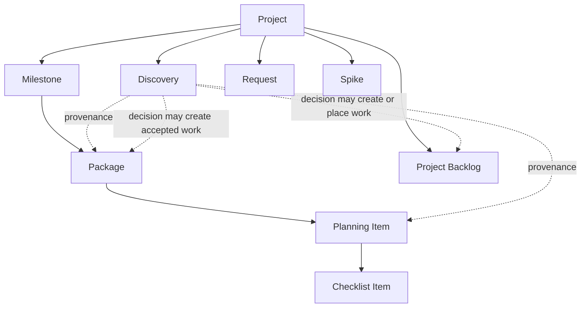
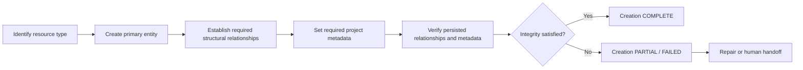

# Canonical PM Resource Model

> Status: M1 / PM-P01 / PLAN02 — Ready for review
>
> Purpose: Define the canonical project-management resources, their ownership and structural relationships, and the integrity rules that all PM skills and storage adapters must preserve.

This document is the authoritative source for **resource structure and relationship integrity**. It intentionally does not define workflow status transitions, review authority, approval policy, or discovery decision routing; those belong to their dedicated contracts.

## 1. Design principles

1. Resource structure is independent of any storage product.
2. Structural ownership, workflow status, scope commitment, provenance, and dependency are separate dimensions.
3. Every structural relationship has one authoritative source of truth.
4. Child resources do not duplicate ownership metadata that can be derived from their parent unless an adapter explicitly maintains a denormalized projection.
5. Creating an entity is not enough: required relationships and required project metadata must also be established and verified.
6. A resource whose required relationships are missing is in an incomplete / invalid creation state and must not be reported as successfully created.
7. Project Backlog membership is an explicit project-level placement relation; it is not inferred from workflow status or missing Milestone metadata.

---

## 2. Canonical resource hierarchy



The solid hierarchy represents structural ownership. Dashed arrows represent contextual or decision-driven relationships, not ownership.

### 2.1 Project

The Project is the durable top-level management boundary.

A Project owns or provides context for:

- Milestones,
- Project Backlog membership,
- Packages,
- Planning Items through their Package,
- Discoveries,
- Requests,
- Spikes,
- other project records introduced by approved future contracts.

A Project is not a workflow Status and does not itself imply a delivery deadline.

### 2.2 Milestone

A Milestone is a bounded delivery objective governed by Goal, Scope, and Exit Criteria.

Canonical structural rule:

> A Milestone directly owns accepted Packages, not Planning Items.

Planning Items inherit Milestone membership through their Parent Package.

A Milestone should therefore not maintain a second, independent list of the same Planning Items as direct scope children.

### 2.3 Package

A Package is the stable, independently trackable unit of accepted work.

A Package may:

- belong to a Milestone,
- own zero or more Planning Items,
- participate in dependency relationships with peer work,
- carry its own workflow Status, Priority, Sequence, Acceptance Criteria, and implementation context.

Package identity is stable and does not encode execution order.

### 2.4 Planning Item

A Planning Item is an independently trackable child decomposition of a Package.

Canonical invariant:

> **EVERY PLANNING ITEM HAS EXACTLY ONE PARENT PACKAGE.**

A Planning Item:

- must have exactly one Parent Package,
- inherits Milestone scope membership from that Parent Package,
- may have its own Status, Acceptance Criteria, blocker state, discussion, and deliverable,
- must not maintain a conflicting independent Milestone ownership record.

A Planning Item without a Parent Package is an **orphan** and is not considered successfully created.

### 2.5 Checklist Item

A Checklist Item is lightweight execution detail embedded in a Package or Planning Item.

It should not be promoted to an independent resource unless it requires its own lifecycle, discussion, blocker state, acceptance record, or ownership relationship.

---

## 3. Project Backlog model

### 3.1 Definition

The Project Backlog is the Project-level retained-work collection for potentially valuable work that is **not currently committed to an active Milestone or another explicitly approved execution scope**.

Project Backlog is a scope / commitment placement concept.

It is not a workflow Status.

Canonical rule:

> **PROJECT BACKLOG ≠ STATUS: BACKLOG**

### 3.2 Authoritative membership

Project Backlog membership must be represented by an explicit, authoritative placement relationship that a PM skill or adapter can query deterministically.

The canonical domain model requires an effective relation equivalent to:

```text
Project Backlog membership = TRUE | FALSE
```

The storage adapter may implement this as a field, collection, label, relationship, or another supported representation, but it must provide one unambiguous source of truth.

### 3.3 Forbidden inference rules

A PM skill or adapter must not infer Project Backlog membership solely from either of these conditions:

```text
Status = Backlog
```

or:

```text
Milestone = empty
```

Reasons:

- A Package already committed to a Milestone may legitimately have `Status = Backlog` while waiting for execution.
- A Planning Item may intentionally have no direct Milestone metadata because its Milestone ownership is inherited from its Parent Package.
- Other project-level resources may legally have no Milestone while still not being Project Backlog work.

### 3.4 Typical Project Backlog members

Depending on triage outcome, Project Backlog may retain resources such as:

- Requests,
- deferred Bugs,
- deferred architecture work,
- work resulting from a Discovery,
- future Spike candidates,
- other uncommitted but valuable work.

The decision to place an item in Project Backlog belongs to the decision model, not this structural contract.

---

## 4. Intake and emerging-work resources

### 4.1 Discovery

A Discovery is a project-level evidence and context record created before a project-management decision is made.

A Discovery may record `Discovered In` links to a Milestone, Package, Planning Item, review, execution activity, or incident.

`Discovered In` is provenance only.

It does not create structural ownership under the resource where the Discovery was found.

Canonical rule:

> **FOUND DURING MILESTONE ≠ BELONGS TO MILESTONE**

A Discovery may later be linked to resulting work or Project Backlog placement after triage, but the Discovery itself does not silently modify scope.

### 4.2 Request

A Request is proposed work that has not yet been accepted into an execution scope.

A Request may exist at Project level while awaiting triage, may be retained in Project Backlog, may be rejected, or may result in accepted work.

The resource model defines where it can exist; the decision model defines how that decision is made.

### 4.3 Spike

A Spike is a bounded investigation resource.

A Spike may be Project-level or associated with an approved Package depending on why the investigation exists. Its structural placement must be explicit and must not be inferred from where the uncertainty was first discovered.

The Spike's decision semantics and completion routing belong to the decision model.

---

## 5. Relationship taxonomy

The canonical model distinguishes the following relationship types.

### 5.1 Structural ownership

Structural ownership answers:

> Where does this resource belong?

Examples:

```text
Milestone → Package
Package → Planning Item
Planning Item → Checklist Item
```

Structural ownership must have one authoritative source of truth.

### 5.2 Project Backlog placement

Project Backlog placement answers:

> Is this retained work currently outside approved execution scope and placed in the Project Backlog?

This is a Project-level commitment / placement relationship, not a workflow state.

### 5.3 Provenance (`Discovered In`)

Provenance answers:

> Where was this information discovered?

A provenance relationship does not imply ownership, scope membership, priority, or execution order.

### 5.4 Dependency

Dependency answers:

> What work constrains another work item's ability or order to proceed?

Examples include:

- blocks,
- blocked by,
- requires,
- prerequisite for.

Dependency is orthogonal to Parent / Child ownership.

### 5.5 Workflow relationship

Workflow state and state transitions describe execution lifecycle, not structural ownership.

The authoritative workflow state machine belongs to `docs/core/workflow-contract.md` once PLAN07 is complete.

---

## 6. Ownership and scope inheritance

### 6.1 Milestone ownership chain

For normal Milestone work, the canonical ownership chain is:

```text
Project
└─ Milestone
   └─ Package
      └─ Planning Item
```

The Package is the direct Milestone scope member.

The Planning Item inherits that scope membership from the Package.

### 6.2 No duplicate child Milestone ownership

A Planning Item should not maintain an independent canonical Milestone ownership record when its Parent Package already determines that relationship.

If a storage tool exposes a duplicated Milestone field for convenience, that value is only a denormalized projection and must never override the Parent Package relationship.

If the projected Milestone conflicts with the Parent Package's Milestone, the Parent Package relationship is authoritative and the adapter must report or repair the inconsistency.

### 6.3 Work outside the current Milestone

Not all approved work must automatically become part of the currently active Milestone.

For example, urgent interruption work may be approved for immediate execution while the current Milestone scope remains unchanged.

This resource model therefore does not equate:

```text
approved execution work = current Milestone member
```

The exact representation of approved Project-level execution streams outside a Milestone may be specialized by a later contract or adapter, but no adapter may falsely attach such work to the active Milestone merely because it is urgent.

---

## 7. Planning Item parent invariant

### 7.1 Valid state

A valid Planning Item must satisfy all of the following:

```text
Work Type = Planning
Parent Package exists
Parent Package relationship count = 1
Parent Package is a Package resource
Required project metadata is present
Relationship verification succeeds
```

### 7.2 Invalid states

The following are invalid / incomplete states:

```text
Planning Item with no Parent Package
Planning Item with multiple competing Parent Packages
Planning Item whose parent is not a Package
Planning Item whose body names a parent but no structural relationship exists
Planning Item whose required Project metadata could not be established
```

Text such as:

```text
Parent Package: #1
```

inside an Issue body is documentation only. It does not replace the canonical structural Parent relationship.

### 7.3 Orphan handling

If an orphan Planning Item is detected, the Agent must:

1. stop claiming successful creation,
2. identify the intended Parent Package if evidence is sufficient,
3. establish and verify the Parent relationship when authorized and technically possible,
4. otherwise report partial failure and request the required human or capable-adapter action,
5. avoid starting normal execution until the structural integrity problem is resolved.

---

## 8. Resource creation transaction

Resource creation is a logical transaction, even when the storage system requires several API calls.

### 8.1 Canonical creation phases



### 8.2 Creation result

Creation result is not a workflow Status. It is an operation result.

Canonical operation outcomes are:

- `COMPLETE` — entity and all required relationships / metadata were created and verified.
- `PARTIAL` — primary entity exists, but one or more required relationships or metadata writes could not be completed.
- `FAILED` — the primary resource could not be created or the operation cannot be safely represented.

### 8.3 Mandatory verification

An Agent must verify persisted state after multi-step creation when the adapter supports verification.

For a Planning Item this includes verifying at least:

```text
Issue exists
Work Type = Planning
Parent Package relationship exists
Parent Package is the intended Package
Required Project membership / metadata exists
```

The Agent must not convert a partial result into a success message merely because the Issue itself exists.

### 8.4 Adapter capability failure

If the adapter cannot create a required relationship, the correct result is:

```text
Creation Result = PARTIAL
```

with an explicit handoff describing:

- what was created,
- what remains missing,
- why the adapter could not complete it,
- what authorized human or capable adapter action is required.

---

## 9. Canonical resource integrity invariants

All PM skills and adapters must preserve these rules:

1. **EVERY PLANNING ITEM HAS EXACTLY ONE PARENT PACKAGE.**
2. A Planning Item without its structural Parent relationship is orphaned and incomplete.
3. A body reference to a parent does not substitute for the structural Parent relationship.
4. Planning Items inherit Milestone scope from their Parent Package.
5. Child resources must not create a competing canonical Milestone ownership source of truth.
6. **PROJECT BACKLOG ≠ STATUS: BACKLOG.**
7. Project Backlog membership must have one explicit, authoritative representation.
8. Project Backlog membership must not be inferred solely from `Status = Backlog`.
9. Project Backlog membership must not be inferred solely from `Milestone = empty`.
10. `Discovered In` is provenance, not ownership.
11. Parent / Child and Dependency relationships are different and must not be substituted for each other.
12. Resource creation is incomplete until required relationships and metadata are persisted and verified.
13. An adapter that cannot complete required resource integrity must report `PARTIAL` or `FAILED`, not success.
14. Technical storage convenience must not override the canonical structural relationship model.

---

## 10. Initial GitHub mapping

The canonical model is product-independent. The initial GitHub implementation is expected to map resources as follows:

| Canonical resource / relation | Initial GitHub representation | Authority note |
|---|---|---|
| Project | GitHub Project | Management / projection layer |
| Milestone | GitHub repository Milestone | Directly associated with Package Issues in the initial single-repo model |
| Package | GitHub Issue, `Work Type = Package` | Package Issue carries native Milestone membership |
| Planning Item | GitHub Issue, `Work Type = Planning` | Must have native Parent/Sub-issue relationship to Package |
| Parent Package | GitHub Parent issue / Sub-issue relationship | Authoritative structural relationship |
| Checklist Item | Markdown task list inside Package / Planning Item | Lightweight, non-independent step |
| Discovery | GitHub Issue, `Work Type = Discovery` | Project-level until triage decides resulting work placement |
| Request | GitHub Issue, `Work Type = Request` | May later become Project Backlog or accepted work |
| Spike | GitHub Issue, `Work Type = Spike` | Placement depends on approved context |
| Project Backlog membership | Adapter-defined explicit Project representation | Must not be inferred from Status or empty Milestone |
| Dependency | GitHub-supported dependency / linkage representation when available, otherwise adapter-managed explicit relation | Must remain distinct from Parent/Sub-issue |

### 10.1 GitHub Milestone limitation

GitHub native Milestones are repository-scoped.

The initial implementation intentionally assumes a single-repository Milestone model. Cross-repository Milestone / initiative modeling is outside PLAN02 and requires an explicit later design rather than silently overloading the native GitHub Milestone concept.

### 10.2 Project fields are projections, not alternate ownership records

Custom Project fields may expose derived values for filtering, grouping, or automation.

They must not create competing ownership truth when a canonical native relationship already exists.

For example:

```text
Planning Item Parent issue = authoritative
Planning Item custom "Parent Package" text = non-authoritative duplicate and should be avoided
```

---

## 11. Boundary with other core contracts

This document owns:

- canonical resource hierarchy,
- structural ownership,
- Project Backlog placement semantics,
- Planning Parent invariant,
- orphan / incomplete resource handling,
- resource creation integrity,
- product-independent mapping requirements.

It does **not** own:

- Discovery decision routing (`decision-model.md`, PLAN03),
- skill-to-skill handoff schema (`handoff-contract.md`, PLAN04),
- approval matrix (`approval-policy.md`, PLAN05),
- workflow Status transitions / Action Owner / Transition Authority / Review contract (`workflow-contract.md`, PLAN07).

This separation is normative: downstream skills and adapters should reference the appropriate source of truth instead of duplicating these policies.
