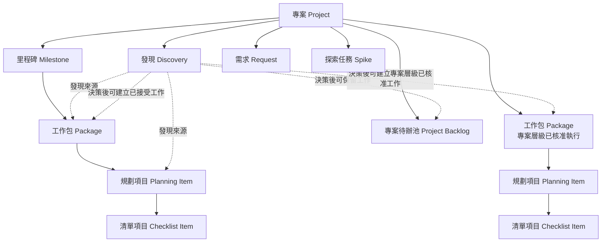
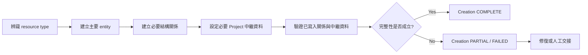

# PM 核心資源模型

> 狀態：M1 / PM-P01 / PLAN02 — 中文化修訂完成，待重新審查
>
> 用途：定義權威專案管理資源、資源之間的結構歸屬關係，以及所有 PM Skills 與儲存轉接器（storage adapters）都必須維持的完整性規則。
>
> 文件語言：以繁體中文為主。實際 GitHub 欄位值、固定結果代碼，或難以精準翻譯的術語，保留英文原文或於首次出現時中英並列。

本文件是**資源結構與關係完整性**的唯一權威來源（authoritative source of truth）。工作流程 `Status` 轉換、審查權限、核准政策與 Discovery 決策路由，不在本文件定義範圍內，分別由其他專屬契約負責。

## 1. 設計原則

1. 資源結構不依賴任何特定儲存產品。
2. 結構歸屬、工作流程 `Status`、範圍承諾、來源脈絡（provenance）與相依關係（Dependency）是不同維度。
3. **執行歸屬（Execution Placement）是已接受工作包的權威結構歸屬關係；它不是第二份歸屬紀錄。**
4. 每一種結構關係都只能有一個權威來源。
5. 子資源不應重複維護可以從父資源推導出的歸屬中繼資料；除非轉接器明確把它維護為非正規化投影（denormalized projection）。
6. 建立 entity 本身不代表建立完成；必要關係與 Project 中繼資料也必須建立並驗證。
7. 缺少必要關係的資源屬於建立未完成／非法狀態，不得回報為建立成功。
8. 專案待辦池（Project Backlog）membership 是明確的專案層級歸屬關係；不能由工作流程 `Status` 或缺少 Milestone 中繼資料推導。
9. 每個已接受工作包必須且只能有一個明確的 **Execution Placement**：某一個 Milestone，或所有 Milestone 之外的「專案層級已核准執行」。

---

## 2. 權威資源階層



實線代表權威結構關係。

對已接受工作包而言，指向工作包的 incoming structural edge 就是它的**執行歸屬（Execution Placement）**。上圖的兩個工作包節點是**同一種權威 Package resource type**，只是分別顯示在兩種合法執行歸屬下：

1. Milestone 執行 — `Milestone → Package`；或
2. 專案層級已核准執行 — `Project → Package`，且不屬於任何 Milestone。

這不是同時維護 ownership 與 placement 兩份紀錄；Execution Placement edge 本身就是 Package 的權威結構歸屬。

較低層工作則由 `Package → Planning Item → Checklist Item` 表示父／子拆解關係。

虛線代表情境或決策產生的關係，不代表結構歸屬。

### 2.1 專案（Project）

Project 是持久存在的最高層管理邊界。

Project 擁有或提供以下資源的管理脈絡：

- Milestone；
- 專案層級已核准執行的 Package；
- Project Backlog membership；
- Package；
- 透過 Package 所屬的 Planning Item；
- Discovery；
- Request；
- Spike；
- 後續經核准契約所引入的其他 Project records。

Project 不是工作流程 `Status`，本身也不代表交付期限。

### 2.2 里程碑（Milestone）

Milestone 是由目標（Goal）、範圍（Scope）與結束條件（Exit Criteria）治理的有限交付目標。

權威結構規則：

> Milestone 是已接受 Package 的合法 Execution Placement，不是 Planning Item 的直接 Execution Placement。

當 Package 的 Execution Placement 指向某一個 Milestone，該 Package 就直接承諾進入這個 Milestone。

Planning Item 透過 Parent Package 繼承 Milestone membership。

因此 Milestone 不應再維護第二份相同 Planning Item 的直接範圍子項目清單。

### 2.3 工作包（Package）

Package 是已接受、具有穩定識別且可獨立追蹤的工作單位。

Package 必須且只能有一個權威 **Execution Placement**；這個關係同時就是 Package 的權威結構歸屬：

- **Milestone 歸屬** — `Milestone → Package`；Package 直接承諾進入且只能屬於一個 Milestone；或
- **專案層級已核准執行** — `Project → Package`；Package 已被核准直接在 Project 下執行，且刻意不屬於任何 Milestone。

Package 可以：

- 透過 Execution Placement 屬於某個 Milestone；
- 透過 Execution Placement 在所有 Milestone 之外進行專案層級已核准執行；
- 擁有 0 個或多個 Planning Item；
- 與同層工作形成相依關係；
- 擁有自己的工作流程 `Status`、`Priority`、`Sequence`、Acceptance Criteria 與實作脈絡。

Package 不得同時使用兩種權威 Execution Placement。轉接器也不得在 Execution Placement 之外再建立第二個權威 Package ownership field。

Package 從一種歸屬移動到另一種歸屬，屬於受治理的專案管理變更，不是普通的工作流程 Status change。

Package identity 必須保持穩定，不能把執行順序編進識別碼。

### 2.4 規劃項目（Planning Item）

Planning Item 是 Package 底下可獨立追蹤的工作拆解。

權威不變條件：

> **每個 Planning Item 必須且只能有一個 Parent Package。**

Planning Item：

- 必須且只能有一個 Parent Package；
- 繼承 Parent Package 的 Execution Placement，以及存在時的 Milestone 範圍歸屬；
- 可以有自己的 `Status`、Acceptance Criteria、阻塞狀態、討論與交付物；
- 不得維護互相衝突的獨立 Milestone 或執行歸屬紀錄。

沒有 Parent Package 的 Planning Item 是 **orphan（孤兒）**，不得視為建立成功。

### 2.5 清單項目（Checklist Item）

Checklist Item 是嵌入在 Package 或 Planning Item 裡的輕量執行細節。

除非它需要自己的生命週期、討論、阻塞狀態、驗收紀錄或結構歸屬關係，否則不應提升成獨立資源。

---

## 3. 專案待辦池（Project Backlog）模型

### 3.1 定義

Project Backlog 是專案層級的 retained-work collection，用來保存**目前尚未承諾進入 active Milestone 或其他明確已核准執行範圍**、但仍可能有價值的工作。

Project Backlog 是範圍／承諾歸屬概念。

它不是工作流程 `Status`。

權威規則：

> **Project Backlog ≠ `Status = Backlog`**

### 3.2 權威 membership

Project Backlog membership 必須由明確、具權威性，且 PM Skill / 轉接器可以確定性查詢的歸屬關係表示。

權威領域模型至少要求等價於以下關係：

```text
Project Backlog membership = TRUE | FALSE
```

儲存轉接器可以使用欄位、集合、標籤、關係或其他支援方式落地，但只能有一個不含糊的權威來源。

### 3.3 禁止的推導方式

PM Skill 或轉接器不得只依據以下任一條件推導 Project Backlog membership：

```text
Status = Backlog
```

或：

```text
Milestone = empty
```

原因：

- 已承諾進入 Milestone 的 Package，在等待執行時可以合法處於 `Status = Backlog`。
- 專案層級已核准執行的 Package 刻意沒有 Milestone，但仍是已接受工作。
- Planning Item 可以刻意不直接維護 Milestone 中繼資料，因為其 Execution Placement 與 Milestone 歸屬是由 Parent Package 繼承。
- 其他專案層級資源也可能合法沒有 Milestone，但並不屬於 Project Backlog。

### 3.4 常見 Project Backlog 成員

依分類判定（triage）結果，Project Backlog 可以保存：

- Request；
- 延後處理的 Bug；
- 延後處理的架構工作；
- Discovery 所產生但尚未承諾的工作；
- 未來可能進行的 Spike；
- 其他尚未承諾但具有價值的工作。

是否把某項工作放入 Project Backlog，由 decision model 決定，不由本結構契約決定。

### 3.5 Project Backlog 與已接受執行工作

保留在 Project Backlog 的資源位於已核准執行範圍之外。

一旦工作被接受成為要執行的 Package，就必須離開 Project Backlog 歸屬，並取得且只能取得一個權威 Execution Placement：

```text
Milestone:<id>
```

或：

```text
專案層級已核准執行
```

同一個 item 不得同時是權威 Project Backlog work 與已接受執行 Package。

---

## 4. 輸入與執行中出現的工作資源

### 4.1 發現（Discovery）

Discovery 是在專案管理決策做出之前，用來保存證據與情境的專案層級紀錄。

Discovery 可以用 `Discovered In` 連結到 Milestone、Package、Planning Item、審查、執行活動或事件。

`Discovered In` 只代表來源脈絡（provenance）。

它不會讓 Discovery 自動成為「被發現位置」底下的結構子項目。

權威規則：

> **在 Milestone 中發現 ≠ 屬於該 Milestone（FOUND DURING MILESTONE ≠ BELONGS TO MILESTONE）**

Discovery 經分類判定後可以連到後續產生的工作或 Project Backlog 歸屬，但 Discovery 本身不能默默修改範圍。

### 4.2 需求（Request）

Request 是尚未被接受進入執行範圍的 proposed work。

Request 可以在專案層級等待分類判定，也可以被保留在 Project Backlog、不採納，或產生已接受工作。

資源模型定義它可以存在的位置；決策模型定義如何做出上述決策。

### 4.3 探索任務（Spike）

Spike 是有明確邊界的調查資源。

依調查原因不同，Spike 可以位於專案層級，或與已核准 Package 關聯。它的結構歸屬必須明確，不能由「不確定性最早在哪裡被發現」來推導。

Spike 的決策語意與完成後路由由決策模型負責。

---

## 5. 關係分類

權威模型區分以下關係類型，同時要求每一個已儲存關係都只有一個權威來源。

### 5.1 結構關係（Structural Relationships）

結構關係回答：

> 這個資源在權威 PM 模型中正式屬於哪裡？

主要包含兩種子類型：

```text
結構關係
├─ Package 執行歸屬（Execution Placement）
│  ├─ Milestone → Package
│  └─ Project → Package [專案層級已核准執行]
└─ 父／子拆解
   ├─ Package → Planning Item
   └─ Planning Item → Checklist Item
```

`Project → Milestone` 也是交付邊界層級的結構包含關係。

同一個已儲存關係可以有更專門的語意名稱。`Milestone → Package` 與 `Project → Package [專案層級已核准執行]` 特別稱為 **Execution Placement**，因為它們表示 Package 正式屬於哪個已核准執行範圍。

這個專門名稱**不代表需要第二份 ownership record**。

### 5.2 執行歸屬（Execution Placement）

Execution Placement 是 **Package 專用的結構歸屬關係**。

它回答：

> 這個已接受的 Package 現在正式屬於哪一個已核准執行範圍？

每個已接受 Package 必須且只能有一個權威 Execution Placement：

```text
Milestone:<id>
```

或：

```text
專案層級已核准執行
```

對 Package 而言：

> **Execution Placement = authoritative structural placement**

不得再存在另一個互相競爭的 `Package Owner`、`Structural Owner` 或等價權威關係，去重複表示相同的 Milestone / Project 歸屬。

同一時間一個 Package 只能位於其中一種歸屬。

「專案層級已核准執行」用於必須在所有 Milestone 之外立即／主動執行的已接受工作，例如已核准的 Interruption。它**不會**默默擴大 active Milestone 範圍。

Package 要進入「專案層級已核准執行」，必須具備來自適用決策／核准契約的明確已核准決策或授權脈絡。只有 `Milestone = empty` 不足以證明這個歸屬。

儲存轉接器必須從單一權威表示方式暴露或推導足夠資訊，使 PM Skill 能區分：

- Milestone Package；
- 專案層級已核准執行的 Package；
- Project Backlog work；
- 其他專案層級紀錄。

若儲存產品同時提供原生關係與投影欄位，必須指定其中一份為權威，另一份只能是衍生中繼資料；兩者不能都是獨立可寫入的權威來源。

### 5.3 Project Backlog 歸屬

Project Backlog 歸屬回答：

> 這個保留工作是否目前位於已核准執行範圍之外，並正式被放在 Project Backlog？

這是專案層級的承諾／歸屬關係，不是工作流程狀態。

Project Backlog 歸屬與已接受 Package 的 Execution Placement 必須互斥。

### 5.4 來源脈絡（Provenance / `Discovered In`）

來源脈絡回答：

> 這項資訊是在什麼地方被發現？

來源脈絡關係不代表結構歸屬、範圍歸屬、優先級或執行順序。

### 5.5 相依關係（Dependency）

相依關係回答：

> 哪一項工作限制另一項工作能否或何時繼續？

常見語意包括：

- `blocks`；
- `blocked by`；
- `requires`；
- `prerequisite for`。

相依關係與結構歸屬／父／子關係是互相獨立的概念。

### 5.6 工作流程關係

工作流程狀態與狀態轉換描述執行生命週期，不描述結構歸屬。

權威 workflow state machine 將由 PLAN07 完成後的 `docs/core/workflow-contract.md` 定義。

---

## 6. 歸屬與範圍繼承

### 6.1 Milestone Execution Placement 鏈

一般 Milestone 工作的權威結構鏈：

```text
Project
└─ Milestone
   └─ Package
      └─ Planning Item
```

對 Package 而言，`Milestone → Package` 就是它唯一權威的 Execution Placement。

Planning Item 繼承該 Package 的 Milestone 範圍歸屬。

### 6.2 子項目不重複維護 Milestone 歸屬

當 Parent Package 已能決定 Milestone 關係時，Planning Item 不應維護另一份獨立權威 Milestone 歸屬紀錄。

若儲存工具為方便查詢而提供重複的 Milestone 欄位，該欄位只能是非正規化投影，不得覆蓋 Parent Package 關係與繼承而來的 Execution Placement。

若投影出的 Milestone 與 Parent Package 的 Execution Placement 衝突，以 Parent Package 所推導出的歸屬為權威，轉接器必須回報或修復不一致。

### 6.3 專案層級已核准執行的 Execution Placement 鏈

已核准工作可以在所有 Milestone 之外執行，而不修改任何 Milestone 範圍。

權威結構鏈：

```text
Project
└─ Package [Execution Placement = 專案層級已核准執行]
   └─ Planning Item
```

對 Package 而言，`Project → Package [專案層級已核准執行]` 就是它唯一權威的 Execution Placement。

這條路徑用於專案管理決策已授權立即／主動執行工作，但明確要求它保持在 Milestone 範圍之外的情境。

例如：已核准的 Interruption 可以在目前 Milestone 不變的情況下，建立或啟用一個專案層級已核准執行的 Package。

權威規則：

```text
已核准執行工作 ≠ 目前 Milestone 成員
```

以及：

```text
Milestone = empty ≠ 專案層級已核准執行
```

第二條特別重要，因為只看 Milestone 中繼資料為空，無法區分專案層級已核准執行、Project Backlog work 或其他專案層級紀錄。

### 6.4 Execution Placement 繼承

Planning Item 繼承 Parent Package 的 Execution Placement；它本身不擁有第二份 Execution Placement 關係。

因此：

- Milestone Package 底下的 Planning Item，間接屬於該 Milestone 範圍；
- 專案層級已核准執行 Package 底下的 Planning Item，仍位於所有 Milestone 之外；
- Planning Item 不得維護競爭性的第二份權威執行歸屬紀錄。

### 6.5 歸屬之間的移動

Package 從一種 Execution Placement 移動到另一種，會改變專案承諾／範圍歸屬，必須透過適用的決策／核准流程。

例如：

```text
Project Backlog → Milestone
Project Backlog → 專案層級已核准執行
專案層級已核准執行 → Milestone
Milestone → Project Backlog
```

這些都不是普通工作流程 Status transition。

---

## 7. Planning Item 父項不變條件

### 7.1 合法狀態

合法 Planning Item 必須同時滿足：

```text
Work Type = Planning
Parent Package exists
Parent Package relationship count = 1
Parent Package is a Package resource
Required project metadata is present
Relationship verification succeeds
```

其中 `Work Type = Planning` 為實際 GitHub Project 欄位／值，因此保留英文 token；其餘內容描述的是驗證條件，不是新增 GitHub 欄位。

### 7.2 非法／未完成狀態

以下都屬於非法或未完成狀態：

```text
Planning Item 沒有 Parent Package
Planning Item 有多個互相競爭的 Parent Package
Planning Item 的 parent 不是 Package
Planning Item body 雖寫了 parent，但實際 structural relationship 不存在
Planning Item 必要 Project metadata 無法建立
```

Issue body 中的：

```text
Parent Package: #1
```

只是文件說明，不能取代權威父子結構關係。

### 7.3 Orphan 處理

Agent 發現 orphan Planning Item 時必須：

1. 停止宣稱建立成功；
2. 若證據足夠，找出預期的 Parent Package；
3. 在具有權限且技術可行時，建立並驗證 Parent relationship；
4. 否則回報部分失敗（partial failure），要求適當的人員或具能力轉接器完成；
5. 在結構完整性修復以前，不開始正常執行。

---

## 8. 資源建立交易（Resource Creation Transaction）

即使儲存系統需要多次 API call，resource creation 在 PM 領域上仍視為一個邏輯交易（logical transaction）。

### 8.1 權威建立階段



### 8.2 建立結果

建立結果不是工作流程 `Status`，而是操作結果。

固定操作結果代碼：

- `COMPLETE` — entity 與所有必要關係／中繼資料均已建立並驗證。
- `PARTIAL` — 主要 entity 已存在，但一個以上必要關係或中繼資料寫入尚未完成。
- `FAILED` — 主要資源無法建立，或目前操作無法被安全地表示。

### 8.3 強制驗證

當轉接器支援讀回驗證時，Agent 在多步驟建立完成後必須驗證已儲存狀態。

對 Planning Item，至少驗證：

```text
Issue exists
Work Type = Planning
Parent Package relationship exists
Parent Package is the intended Package
Required Project membership / metadata exists
```

對已接受 Package，至少驗證：

```text
Package exists
Work Type = Package
Exactly one canonical Execution Placement exists
Execution Placement is the Package's authoritative structural placement
Execution Placement matches the approved decision
No competing Package ownership / placement relationship exists
Project Backlog placement is not simultaneously authoritative
Required Project membership / metadata exists
```

上述區塊是固定驗證 contract，因此保留英文，以便未來 Skill / adapter 可直接引用。

即使 Issue 已成功建立，Agent 也不得把 `PARTIAL` 結果包裝成 success。

### 8.4 轉接器能力不足

若轉接器無法建立某個必要關係，正確操作結果是：

```text
Creation Result = PARTIAL
```

交接內容必須明確說明：

- 已建立哪些內容；
- 還缺少哪些內容；
- 轉接器為什麼無法完成；
- 需要哪個已授權人員或具能力轉接器執行什麼動作。

---

## 9. 權威資源完整性不變條件

所有 PM Skills 與轉接器都必須維持：

1. **每個 Planning Item 必須且只能有一個 Parent Package。**
2. 沒有結構 Parent relationship 的 Planning Item 是 orphan 且建立未完成。
3. Issue body 的 parent 文字不能取代結構 Parent relationship。
4. Planning Item 從 Parent Package 繼承 Execution Placement，以及存在時的 Milestone 範圍。
5. 子資源不得建立競爭性的權威 Milestone 或 Execution Placement 來源。
6. **每個已接受 Package 必須且只能有一個 Execution Placement。**
7. **Execution Placement 是已接受 Package 的權威結構歸屬；它不是第二份 ownership record。**
8. 合法 Package Execution Placement 只有「某一個 Milestone」或「所有 Milestone 之外的專案層級已核准執行」。
9. Package 不得同時具有 Milestone placement 與專案層級已核准執行 placement。
10. 轉接器不得維護另一個獨立權威 Package ownership field 去重複 Execution Placement。
11. **Project Backlog ≠ `Status = Backlog`。**
12. Project Backlog membership 必須有一個明確、具權威性的表示方式。
13. Project Backlog membership 與已接受 Package 的 Execution Placement 必須互斥。
14. 不得只由 `Status = Backlog` 推導 Project Backlog membership。
15. 不得只由 `Milestone = empty` 推導 Project Backlog membership。
16. 不得只由 `Milestone = empty` 推導專案層級已核准執行。
17. `Discovered In` 是來源脈絡，不是結構歸屬。
18. Parent / Child 與 Dependency relationship 不得互相替代。
19. 資源建立在必要關係與中繼資料完成儲存並驗證前，都不算完成。
20. 轉接器若無法完成必要完整性，必須回報 `PARTIAL` 或 `FAILED`，不能回報 success。
21. 儲存工具的技術便利性不能凌駕權威結構關係模型。
22. Project Backlog、Milestone execution、專案層級已核准執行之間的移動屬於受治理的歸屬變更，不是普通工作流程 Status transition。

---

## 10. 初始 GitHub 對應

權威模型不依賴特定產品。初始 GitHub implementation 預期如下：

| 權威資源／關係 | 初始 GitHub 表示方式 | Authority 說明 |
|---|---|---|
| Project | GitHub Project | 管理／投影層 |
| Milestone | GitHub repository Milestone | 交付邊界資源 |
| Package — Execution Placement = Milestone | GitHub Issue、`Work Type = Package`、native Milestone 已設定 | Native Milestone 是權威 Package Execution Placement；不需另建 Package ownership field |
| Package — Execution Placement = 專案層級已核准執行 | GitHub Issue、`Work Type = Package`、native Milestone 為空，另有轉接器定義的明確 Execution Placement | 明確歸屬表示方式本身就是權威 Package 結構歸屬；空 Milestone 本身不足以判斷 |
| Planning Item | GitHub Issue、`Work Type = Planning` | 必須有 native Parent/Sub-issue relationship 指向 Package |
| Parent Package | GitHub Parent issue / Sub-issue relationship | 權威結構拆解關係 |
| Checklist Item | Package / Planning Item 內的 Markdown task list | 輕量、非獨立步驟 |
| Discovery | GitHub Issue、`Work Type = Discovery` | 在分類判定決定後續工作歸屬前維持專案層級 |
| Request | GitHub Issue、`Work Type = Request` | 後續可以進入 Project Backlog 或成為已接受工作 |
| Spike | GitHub Issue、`Work Type = Spike` | 歸屬依已核准脈絡決定 |
| Project Backlog membership | 轉接器定義的明確 Project representation | 不得由 Status 或空 Milestone 推導 |
| Dependency | GitHub 支援的 dependency / linkage；若無則由轉接器管理明確關係 | 必須與結構歸屬、Parent/Sub-issue 分離 |

### 10.1 GitHub Milestone 限制

GitHub 原生 Milestone 是 repository-scoped。

初始 implementation 刻意採單一 repository Milestone model。跨 repository 的 Milestone / initiative modeling 不屬於 PLAN02 範圍；若未來需要，必須另做明確設計，不能默默把 GitHub 原生 Milestone overload 成不同概念。

### 10.2 Project fields 是投影，不是第二份歸屬紀錄

自訂 Project fields 可以提供 filtering、grouping、automation 所需的衍生值，或在沒有權威原生關係時提供明確歸屬。

當權威原生關係已存在時，自訂欄位不得變成競爭性的歸屬權威來源。

例如：

```text
Planning Item Parent issue = authoritative
Planning Item custom "Parent Package" text = non-authoritative duplicate，應避免使用
```

對 Milestone Package：

```text
Native Milestone = authoritative Execution Placement
Custom "Execution Placement" field = optional derived projection only
```

對專案層級已核准執行，GitHub 沒有原生的 Milestone-equivalent relation。轉接器必須定義一個明確的 Project-level representation，並把**該 representation 本身當成 Package 的權威 Execution Placement / structural placement**；不能再建立第二份 ownership record，也不能只從空 Milestone 推導歸屬。

---

## 11. 與其他核心契約的責任邊界

本文件負責：

- 權威資源階層；
- 結構關係分類；
- Package Execution Placement 作為權威 Package 結構歸屬關係；
- Project Backlog 歸屬語意；
- Planning Parent invariant；
- orphan / 建立未完成資源處理；
- 資源建立完整性；
- 不依賴特定產品的對應要求。

本文件**不負責**：

- Discovery 決策路由（`decision-model.md`，PLAN03）；
- Skill-to-Skill 交接格式（`handoff-contract.md`，PLAN04）；
- 核准矩陣（`approval-policy.md`，PLAN05）；
- 工作流程 Status transition / Action Owner / Transition Authority / Review contract（`workflow-contract.md`，PLAN07）。

這個責任切分具有規範性（normative）：下游 Skills 與轉接器應引用正確的權威來源，而不是各自複製一份相同政策。